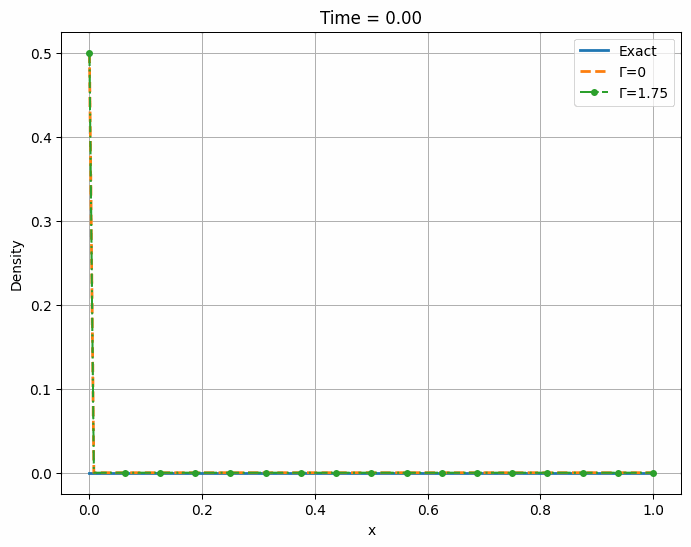

- The graph above shows the errors for gamma = 0 and gamma = 1.75, as $\Delta x$ increases so does the error values. The error line for gamma = 1.75 is slightly more linear compared to that of gamma = 0

